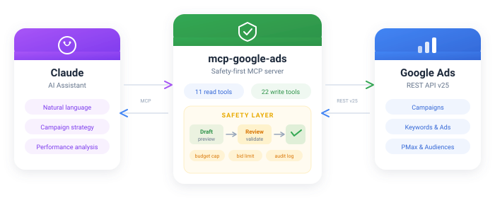

<div align="center">

# mcp-google-ads

**Pilot Google Ads campaigns from Claude with built-in safety guardrails**

<br/>



<br/>
<br/>

[](https://crates.io/crates/mcp-google-ads)
[](LICENSE)
[](https://rust-lang.org)
[](https://modelcontextprotocol.io)
[](https://developers.google.com/google-ads/api)

</div>

---

## Sponsors

<table>
  <tr>
    <td align="center" width="175">
      <a href="https://france-nuage.fr/?mtm_source=github&mtm_medium=sponsor&mtm_campaign=france-nuage&mtm_content=mcp-google-ads">
        <br/>
        <b>France-Nuage</b>
      </a><br/>
      <sub>Sovereign French cloud for your ad data pipelines. EU data residency.</sub>
    </td>
    <td align="center" width="175">
      <a href="https://www.hook0.com/?mtm_source=github&mtm_medium=sponsor&mtm_campaign=hook0&mtm_content=mcp-google-ads">
        <br/>
        <b>Hook0</b>
      </a><br/>
      <sub>Stream Google Ads conversions as signed webhooks. Self-hosted option.</sub>
    </td>
    <td align="center" width="175">
      <a href="https://getnatalia.com/?mtm_source=github&mtm_medium=sponsor&mtm_campaign=natalia&mtm_content=mcp-google-ads">
        <br/>
        <b>Natalia</b>
      </a><br/>
      <sub>AI voice agent qualifies the leads your ads bring in. 24/7 follow-up.</sub>
    </td>
    <td align="center" width="175">
      <a href="https://netir.fr/?mtm_source=github&mtm_medium=sponsor&mtm_campaign=netir&mtm_content=mcp-google-ads">
        <br/>
        <b>Netir</b>
      </a><br/>
      <sub>Hire vetted French freelance ad ops experts via mentored marketplace.</sub>
    </td>
  </tr>
  <tr>
    <td align="center" width="233">
      <a href="https://nobullshitconseil.com/?mtm_source=github&mtm_medium=sponsor&mtm_campaign=nbc&mtm_content=mcp-google-ads">
        <br/>
        <b>NoBullshitConseil</b>
      </a><br/>
      <sub>No-bullshit tech advisory. Marketing tech strategy for founders.</sub>
    </td>
    <td align="center" width="233">
      <a href="https://qualneo.fr/?mtm_source=github&mtm_medium=sponsor&mtm_campaign=qualneo&mtm_content=mcp-google-ads">
        <br/>
        <b>Qualneo</b>
      </a><br/>
      <sub>Qualiopi LMS for French training orgs running ad-funded acquisition.</sub>
    </td>
    <td align="center" width="233">
      <a href="https://recapro.ai/?mtm_source=github&mtm_medium=sponsor&mtm_campaign=recapro&mtm_content=mcp-google-ads">
        <br/>
        <b>Recapro</b>
      </a><br/>
      <sub>Sovereign AI that transcribes client ad reviews &amp; drafts the report.</sub>
    </td>
  </tr>
</table>

> **Interested in sponsoring?** [Get in touch](mailto:rust@fgribreau.com)

---

## What is this?

An MCP server that gives Claude full read + write access to Google Ads accounts via the REST API. Every write operation goes through a two-step safety layer: draft a change, review the preview, then confirm to execute. Budget caps, bid limits, and audit logging prevent accidental spend.

## Features

- **63 tools** - Campaign management, RSA ads, keywords, extensions, PMax, audiences, bidding, scheduling, keyword planner, conversions, geo targeting, policy
- **Two-step safety** - All mutations return a preview; nothing executes until you confirm
- **Budget guardrails** - Configurable daily budget cap, bid increase limits, broad+manual CPC blocker
- **Audit logging** - Every mutation logged to a local JSON file with timestamp and dry-run status
- **Read-only mode** - Expose only read tools for safe observability
- **Zero config files** - Configured entirely via environment variables

---

## Quick Start

### 1. Build

```bash
git clone https://github.com/FGRibreau/mcp-google-ads.git
cd mcp-google-ads
cargo build --release
```

### 2. Set up credentials

```bash
# Generate OAuth2 refresh token
./scripts/generate_token.sh ~/.mcp-google-ads/credentials.json
```

### 3. Configure Claude Code

Add to `~/.claude/settings.json`:

```json
{
  "mcpServers": {
    "google-ads": {
      "command": "/path/to/mcp-google-ads/target/release/mcp-google-ads",
      "env": {
        "GOOGLE_ADS_DEVELOPER_TOKEN": "your-developer-token",
        "GOOGLE_ADS_CUSTOMER_ID": "123-456-7890",
        "GOOGLE_ADS_CREDENTIALS_PATH": "~/.mcp-google-ads/credentials.json",
        "GOOGLE_ADS_TOKEN_PATH": "~/.mcp-google-ads/token.json"
      }
    }
  }
}
```

---

## Configuration

All configuration is via environment variables. No config files.

| Variable | Default | Description |
|----------|---------|-------------|
| `GOOGLE_ADS_DEVELOPER_TOKEN` | *required* | Google Ads API developer token |
| `GOOGLE_ADS_CUSTOMER_ID` | *required* | Target account ID (e.g. `123-456-7890`) |
| `GOOGLE_ADS_CREDENTIALS_PATH` | `~/.mcp-google-ads/credentials.json` | OAuth2 credentials JSON |
| `GOOGLE_ADS_TOKEN_PATH` | `~/.mcp-google-ads/token.json` | Refresh token JSON |
| `GOOGLE_ADS_LOGIN_CUSTOMER_ID` | | MCC manager account ID (optional) |
| `GOOGLE_ADS_MAX_DAILY_BUDGET` | `50.0` | Maximum daily budget allowed per campaign |
| `GOOGLE_ADS_MAX_BID_INCREASE_PCT` | `100` | Maximum bid increase percentage |
| `GOOGLE_ADS_REQUIRE_DRY_RUN` | `true` | Default dry_run to true on confirm_and_apply |
| `GOOGLE_ADS_AUDIT_LOG` | `~/.mcp-google-ads/audit.log` | Path for mutation audit log |
| `GOOGLE_ADS_BLOCKED_OPS` | | Comma-separated list of blocked operations |
| `GOOGLE_ADS_READ_ONLY` | `false` | Disable all write tools |

---

## Tools

### Read (19 tools)

| Tool | Description |
|------|-------------|
| `health_check` | Check server connectivity and configuration |
| `list_accounts` | List all accessible Google Ads accounts |
| `get_account_info` | Account details (currency, timezone, status) |
| `get_campaign_performance` | Campaign metrics (cost, clicks, conversions, CPA) |
| `get_ad_performance` | Ad-level metrics with headlines and descriptions |
| `get_keyword_performance` | Keyword metrics with quality scores |
| `get_search_terms` | Actual user queries that triggered ads (window via date_range_start/end, rows via `limit`) |
| `get_negative_keywords` | List campaign-level negative keywords (shared-list exclusions are separate — see below) |
| `list_negative_keyword_lists` | List negative keyword lists (shared sets) and the campaigns each is attached to |
| `get_negative_keyword_list` | Keywords inside one negative keyword list, with criterion IDs |
| `run_gaql` | Execute arbitrary GAQL queries (json/table/csv) |
| `search_geo_targets` | Find location IDs for geo-targeting |
| `get_geo_performance` | Performance breakdown by location |
| `list_recommendations` | Active Google Ads recommendations |
| `list_extensions` | List campaign extensions (sitelinks, callouts, snippets) |
| `discover_keywords` | Keyword ideas from seed keywords (Keyword Planner) |
| `get_keyword_forecasts` | Historical keyword metrics for forecasting |
| `get_policy_issues` | Disapproved or limited ads and policy violations |
| `get_conversion_actions` | Conversion actions configured in the account |

### Write (39 tools)

All write tools return a preview. Call `confirm_and_apply` with `dry_run=false` to execute.

| Tool | Description |
|------|-------------|
| `draft_campaign` | Create campaign + ad group + keywords. Defaults to PAUSED; pass `status: "ENABLED"` to opt out. |
| `update_campaign` | Modify budget, bidding, targeting |
| `exclude_geo_target` | Exclude a location from a campaign (negative location criterion) |
| `remove_geo_target` | Remove a positively-targeted location from a campaign (destructive) |
| `set_campaign_geo_target_type` | Set a campaign's geo target type (`PRESENCE` vs `PRESENCE_OR_INTEREST`) for positive and/or negative targeting |
| `draft_responsive_search_ad` | Create RSA (3-15 headlines, 2-4 descriptions). Defaults to PAUSED; pass `status: "ENABLED"` to opt out. |
| `update_responsive_search_ad` | Edit an existing RSA in place — headlines, descriptions, final URL, display paths. Only the fields provided are written; preserves the ad's ID and asset performance history, unlike remove + re-create. |
| `create_ad_group` | Create ad group in existing campaign. Defaults to PAUSED; pass `status: "ENABLED"` to opt out. |
| `update_ad_group` | Modify ad group name or CPC bid |
| `draft_keywords` | Add keywords with match types and optional per-keyword `final_url` (landing page override) |
| `remove_keywords` | Remove keywords from ad group (destructive) |
| `update_keyword_final_url` | Change an existing keyword's landing page in place (preserves quality score history, unlike remove + re-create) |
| `add_negative_keywords` | Block irrelevant searches (campaign-level) |
| `remove_negative_keywords` | Remove campaign-level negative keywords (destructive) |
| `create_negative_keyword_list` | Create a negative keyword list (shared set), seed it and attach it to campaigns — one atomic mutate |
| `add_to_negative_keyword_list` | Add keywords to an existing negative keyword list |
| `remove_from_negative_keyword_list` | Remove keywords from a negative keyword list (destructive) |
| `attach_negative_keyword_list` | Attach a negative keyword list to campaigns |
| `detach_negative_keyword_list` | Detach a negative keyword list from campaigns (destructive) |
| `delete_negative_keyword_list` | Delete a negative keyword list entirely (destructive) |
| `draft_sitelinks` | Sitelink extensions |
| `create_callouts` | Callout extensions |
| `create_structured_snippets` | Structured snippet extensions |
| `remove_extension` | Remove a campaign extension (destructive) |
| `create_pmax_campaign` | Performance Max campaign with text assets |
| `add_audience_targeting` | Target audiences (TARGETING/OBSERVATION) |
| `create_portfolio_bidding_strategy` | Portfolio bidding (CPA, ROAS, impression share) |
| `create_conversion_action` | Create a conversion action for server-side click uploads (UPLOAD_CLICKS, gclid-based) |
| `set_conversion_action_primary_status` | Mark a conversion action primary or secondary (demote a value-0 signup out of bidding) |
| `update_keyword_bid` | Modify keyword CPC bid |
| `upload_image_asset` | Upload base64-encoded image |
| `upload_text_asset` | Create reusable text asset |
| `set_campaign_schedule` | Ad scheduling / dayparting |
| `apply_recommendation` | Apply a Google recommendation, optionally with type-specific `apply_parameters` |
| `dismiss_recommendation` | Dismiss a recommendation |
| `pause_entity` | Pause campaign/ad group/ad/keyword |
| `enable_entity` | Enable paused entity |
| `remove_entity` | Permanently remove entity (destructive) |
| `confirm_and_apply` | Execute a previewed change (dry_run=true default) |

---

## Safety Guardrails

| Guard | Behavior |
|-------|----------|
| **Two-step confirm** | Every write returns a plan preview; must call `confirm_and_apply` to execute |
| **Dry-run default** | `confirm_and_apply` defaults to `dry_run=true` — must explicitly set `false` |
| **Budget cap** | Rejects campaigns exceeding `GOOGLE_ADS_MAX_DAILY_BUDGET` |
| **Bid limit** | Rejects bid increases exceeding `GOOGLE_ADS_MAX_BID_INCREASE_PCT` |
| **Broad + Manual CPC** | Blocks BROAD match with MANUAL_CPC (burns budget) |
| **PAUSED by default** | New campaigns/ad groups/ads created PAUSED. Response carries `status_after_apply` + `next_action_hint` describing how to flip to `ENABLED` via the `enable_entity` MCP tool — zero UI step needed. |
| **`require_dry_run` hard guard** | When `GOOGLE_ADS_REQUIRE_DRY_RUN=true`, calling `confirm_and_apply` with `dry_run=false` returns `Err(DryRunRequired)` BEFORE any HTTP traffic. Pass `bypass_require_dry_run=true` for a one-shot override. |
| **Double-confirm hard guard** | Destructive ops flagged `requires_double_confirm` need `confirmed_twice=true` or return `Err(DoubleConfirmRequired)`. |
| **Policy exemptions are opt-in** | A mutate blocked by an *exemptible* ad policy is never silently exempted. The error names each policy and the exact offending text; pass `exempt_policy_violations=true` to retry the same plan with `exemptPolicyViolationKeys` (what the Google Ads UI does automatically). Applied exemptions are echoed back as `policy_exemptions_requested`. |
| **MutateOperation whitelist** | Unknown top-level operation keys (typos, recommendation ops mis-routed) are rejected client-side BEFORE the HTTP call with a clear error pointing at the correct tool. |
| **Blocked operations** | Configure `GOOGLE_ADS_BLOCKED_OPS` to disable specific tools |
| **Read-only mode** | Set `GOOGLE_ADS_READ_ONLY=true` to disable all writes |
| **Audit logging** | Every mutation logged with timestamp, operation, changes, dry_run status |

---

## Credentials Setup

### 1. Create a test account

1. Create a **Manager Account (MCC)** at [ads.google.com](https://ads.google.com/home/tools/manager-accounts/)
2. In the MCC, create a **Test Account** (Settings → Sub-account settings)
3. Note both IDs

### 2. Get a developer token

1. In MCC → **Tools & Settings → API Center**
2. Request a developer token (test access is sufficient)

### 3. Create OAuth2 credentials

1. [Google Cloud Console](https://console.cloud.google.com) → Enable **Google Ads API**
2. **Credentials → Create → OAuth 2.0 Client ID → Desktop App**
3. Download JSON to `~/.mcp-google-ads/credentials.json`

### 4. Generate refresh token

```bash
./scripts/generate_token.sh
```

---

## Comparison with Other Google Ads MCP Servers

| | **mcp-google-ads** (this) | [adloop](https://github.com/kLOsk/adloop) | [mikdeangelis](https://github.com/mikdeangelis/mcp-google-ads) | [grantweston](https://github.com/grantweston/google-ads-mcp-complete) | [Official Google](https://github.com/googleads/google-ads-mcp) |
|---|---|---|---|---|---|
| **Language** | Rust | Python | Python | Python | Python |
| **API version** | v25 | v25 | v25 | v21 | v25 |
| **Total tools** | 50 | 43 | 52 | 63 | 2 |
| **Write tools** | 32 | 16 | 26 | 25 | 0 |
| **Tests** | 322 | partial | 0 | 0 | N/A |

### Features

| Feature | this | adloop | mikdeangelis | grantweston | Official |
|---------|------|--------|-------------|-------------|----------|
| Campaign creation | Search + PMax | Search | Search + PMax | 7 types | - |
| RSA ads | yes | yes | yes | yes | - |
| Ad group CRUD | yes | yes | yes | yes | - |
| Keywords (positive + negative) | yes | yes | yes | yes | - |
| Keyword removal | yes | - | yes | yes | - |
| Extensions (sitelinks, callouts, snippets) | yes | yes | yes | yes | - |
| Extension listing & removal | yes | - | yes | yes | - |
| Audiences | yes | - | - | yes | - |
| Bid adjustments | yes | - | - | yes | - |
| Geo targeting (set/remove) | yes | via update | yes | hardcoded US | - |
| Ad scheduling | yes | - | yes | yes | - |
| Asset upload (image/text) | yes | - | yes | yes | - |
| Recommendations (apply/dismiss) | yes | - | yes | yes | - |
| Keyword Planner (ideas + forecasts) | yes | yes | yes | - | - |
| Conversion tracking | yes | - | yes | - | - |
| Policy issues (disapproved ads) | yes | - | yes | - | - |
| Arbitrary GAQL queries | yes | yes | - | - | yes |
| GA4 integration | - | yes | - | - | - |

### Safety & Reliability

| Guard | this | adloop | mikdeangelis | grantweston | Official |
|-------|------|--------|-------------|-------------|----------|
| Two-step confirm (draft → review → apply) | yes | yes | - | - | N/A |
| Dry-run default | yes | yes | - | - | N/A |
| Budget cap | yes | yes (50EUR) | - | - | N/A |
| Bid increase limit | yes | - | - | - | N/A |
| Broad + Manual CPC blocker | yes | yes | - | - | N/A |
| Campaigns created PAUSED | yes | yes | default | ENABLED | N/A |
| Audit logging (JSON) | yes | yes | - | - | N/A |
| Read-only mode | yes | - | - | - | N/A |
| Blocked operations list | yes | - | - | - | N/A |
| Input validation (char limits, URLs) | yes | yes | Pydantic | partial | N/A |
| Unit test coverage | 322 tests | partial | 0 | 0 | N/A |
| Binary size / startup | 10.8 MB / instant | Python | Python | Python | Python |

---

## Migrating from v0.2.x

v0.3.0 introduces breaking changes that strengthen the safety surface and
unlock zero-UI workflows for agents. Most callers only need to add a
`status: None` field to their existing draft structs.

### MCP-tool callers (the common case)

If you only invoke MCP tools through Claude / an MCP host, **no migration
needed** — the new params are all optional. You can now:

- Pass `status: "ENABLED"` when calling `draft_campaign` /
  `draft_responsive_search_ad` / `create_ad_group` to start the entity
  serving immediately. Default remains `PAUSED`.
- Pass `bypass_require_dry_run: true` to `confirm_and_apply` when you
  intentionally want to skip the dry-run guard (one-shot override).
- Pass `confirmed_twice: true` to `confirm_and_apply` for destructive
  plans flagged `requires_double_confirm`.
- Pass `exempt_policy_violations: true` to `confirm_and_apply` to request a
  Google ad policy exemption when a mutate is blocked by an exemptible
  violation. Required in practice for medical/health keywords, which trip
  `HEALTH_IN_PERSONALIZED_ADS` (and, for contraception terms, `BIRTH_CONTROL`).
  Only keywords can be exempted — responsive search ads cannot.
- Read `status_after_apply` and `next_action_hint` from any draft / apply
  response to know whether a follow-up `enable_entity` call is needed.

### Library callers (Rust API)

```rust
// v0.2.x
DraftRsaParams { config, customer_id, ad_group_id, headlines, descriptions,
                 final_url, path1, path2 }

// v0.3.0
DraftRsaParams { config, customer_id, ad_group_id, headlines, descriptions,
                 final_url, path1, path2, status: None }
//                                       ^^^^^^^^^^^^^ new field
```

```rust
// v0.2.x
DraftCampaignParams { ..., geo_target_ids, language_ids }

// v0.3.0
DraftCampaignParams { ..., geo_target_ids, language_ids, status: None }
```

```rust
// v0.2.x — defaulted to ENABLED (the only outlier)
create_ad_group(&config, cid, campaign_id, name, bid)

// v0.3.0 — default PAUSED (consistent with other write tools)
create_ad_group(&config, cid, campaign_id, name, bid, None)
// Equivalent v0.2.x behaviour:
create_ad_group(&config, cid, campaign_id, name, bid, Some(AdStatus::Enabled))
```

```rust
// v0.2.x
tools::confirm::confirm_and_apply(&config, plan_id, dry_run).await

// v0.3.0
tools::confirm::confirm_and_apply(&config, ConfirmApplyInput {
    plan_id: plan_id.to_string(),
    dry_run,
    bypass_require_dry_run: false,
    confirmed_twice: false,
}).await
```

### Behaviour changes (no API change needed)

- `apply_recommendation` / `dismiss_recommendation` now actually work.
  v0.2.x routed them through `googleAds:mutate` and got 400.
- `require_dry_run = true` now blocks rather than just warning.
- `create_pmax_campaign(start_paused = false)` actually produces an
  `ENABLED` campaign (v0.2.x ignored the param).

See [CHANGELOG.md](CHANGELOG.md) for the full breakdown.

---

## Development

```bash
cargo build              # Build debug
cargo build --release    # Build release binary
cargo test               # Unit + wiremock integration tests (no credentials needed)
cargo clippy --all-targets --all-features -- -D warnings
cargo fmt --check
```

The `tests/integration_test.rs` suite requires real Google Ads test
credentials (`GOOGLE_ADS_TEST_*` env vars); the rest of the test files
(13 wiremock-driven suites) run without any credentials.

---

## License

[MIT](LICENSE)
